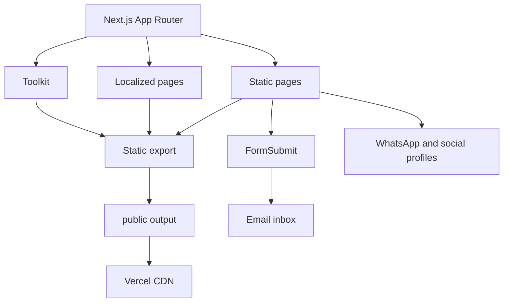

# Ephraim Lifanjo Portfolio

<p align="center">
  
</p>

A fast, static, multilingual software engineering portfolio built with Next.js and React. It is designed for strong crawlability, responsive mobile performance, international SEO and zero backend maintenance.

<p align="center">
  
  &nbsp;&nbsp;&nbsp;
  
</p>

## What this implementation includes

- Static Next.js export: no application server, database or CMS is required.
- Responsive layout: desktop, tablet and small mobile screens are covered.
- System theme detection: light and dark modes can also be changed manually.
- Multilingual discovery: English, French, German, Spanish, Portuguese, Italian, Chinese, Japanese, Korean, Arabic and Russian.
- Automatic browser language detection: English remains the fallback language.
- Search metadata: canonical URLs, hreflang alternates, Open Graph, X cards, Schema.org, sitemap and robots rules.
- Search crawler support: Google, Bing, DuckDuckGo, Apple, Yandex, Baidu, Brave, Qwant and other compatible crawlers.
- AI discovery files: llms.txt plus crawl rules for major AI search agents.
- IndexNow key hosting for compatible search engines.
- Contact without an application backend: FormSubmit, direct email and WhatsApp.
- Local brand identity: EP favicon in the browser and the visible header.
- Local inline technology icons through react-icons, avoiding fragile external icon URLs.
- Photo hover interaction with a reduced motion fallback.
- GitHub Actions production build check on every push to main.

## Architecture



## Project structure

```text
app/
  [lang]/page.js       Localized static landing pages
  toolkit/page.js      Engineering toolkit
  layout.js            Global metadata and Schema.org
  sitemap.js           Search sitemap
  robots.js            Crawler rules
components/
  Brand.jsx            Header logo using the real favicon
  PortfolioPage.jsx    Shared landing page UI
  LanguageSwitcher.jsx Browser language detection and selector
  SocialLinks.jsx      Local SVG social icons
  EducationSheet.jsx   Academic bottom sheet
data/
  site.js              Profile, social links, education and collaboration data
  i18n.js              Localized text and language configuration
public/
  icon.svg              EP favicon and visible brand icon
  ephraim.webp          Optimized portrait
  card.png              Social sharing cover
  llms.txt              Machine readable portfolio summary
scripts/
  export-static.mjs     Copies the Next static export into public
```

## Reproduce this portfolio professionally

### 1. Clone and install

```bash
git clone https://github.com/ephraimlifanjo/ephraim-portfolio.git
cd ephraim-portfolio
npm install
```

### 2. Replace identity assets

Replace these files while keeping their names:

```text
public/icon.svg
public/apple-touch-icon.png
public/ephraim.webp
public/card.png
```

Recommended dimensions:

- Portrait: about 3:4 aspect ratio, WebP, compressed below 100 KB when possible.
- Social card: 1200 by 630 pixels.
- Apple icon: 180 by 180 pixels.
- SVG favicon: square viewBox and simple geometry for sharp rendering at small sizes.

### 3. Edit profile data

Open `data/site.js` and update:

```js
export const site = {
  name: "Your Name",
  fullName: "Your Full Name",
  title: "Your Professional Title",
  email: "you@example.com",
  phone: "+000000000",
  whatsapp: "https://wa.me/000000000",
  url: "https://your-domain.example",
  location: "Your Country",
};
```

Add or remove social profiles in the `socials` array. Keep external profiles in Schema.org `sameAs` by leaving them in this data source.

### 4. Configure education

Edit the `education` array in `data/site.js`. Keep entries concise. The UI displays them in a bottom sheet and does not require a separate education page.

### 5. Configure languages

`data/i18n.js` contains all supported locales and the visible translated copy. English is the default. `LanguageSwitcher.jsx` reads `navigator.language`, stores the preference in localStorage and redirects only when a supported non English language is detected.

Each localized route is generated statically through `app/[lang]/page.js`, which makes every language crawlable without a server.

### 6. Configure the contact form

The form uses FormSubmit:

```html
<form action="https://formsubmit.co/you@example.com" method="POST">
```

No API key is required. FormSubmit can require a one time confirmation from the destination inbox. Direct email and WhatsApp links are kept as independent fallbacks.

### 7. SEO checklist

Before deployment, update:

- `app/layout.js`: title, description, keywords, Open Graph and structured data.
- `app/sitemap.js`: canonical hostname and localized routes.
- `app/robots.js`: sitemap hostname.
- `public/llms.txt`: profile and technology summary.
- `public/7ca8393296cfd5bb7543eabc068cc05e.txt`: replace this IndexNow key if you create your own.

Do not add hundreds of repeated keywords. Search visibility is improved by descriptive content, semantic HTML, valid structured data, fast pages, crawlable localized URLs, trustworthy external profiles and useful backlinks.

### 8. Build the production export

```bash
npm run build
```

The build uses Next.js static export. `scripts/export-static.mjs` then places the generated site in `public/` for the current Vercel static project configuration.

### 9. Deploy on Vercel

Use these project settings when deploying this repository as a static export:

```text
Build command: npm run build
Output directory: public
Node.js: 22 or newer
Environment variables: none required for the portfolio
```

The production domain for this repository is:

```text
https://ephraimlifanjo.vercel.app
```

### 10. Verify after deployment

Check these URLs:

```text
/
/toolkit/
/fr/
/de/
/es/
/zh/
/ja/
/ko/
/ar/
/robots.txt
/sitemap.xml
/llms.txt
```

Then verify the production HTML contains canonical metadata, an Open Graph cover, structured data and hreflang alternate URLs.

## Performance design decisions

- No custom web font request.
- Optimized WebP portrait.
- Static HTML and CDN delivery.
- Inline SVG icons through react-icons.
- `content-visibility` for lower page sections.
- Minimal client JavaScript limited to theme, language and the education sheet.
- Reduced motion support.
- No analytics SDK, database SDK or runtime API client in the landing page.

## Development

```bash
npm run dev
```

Open `http://localhost:3000`.

## Production validation

```bash
npm run build
```

GitHub Actions runs the same production build on every push to `main`.

## License and reuse

The code structure can be adapted for another personal portfolio. Replace the personal portrait, brand assets, profile data, social accounts and written biography before publishing your own version.

© 2026 Ephraim Lifanjo Sewa.
