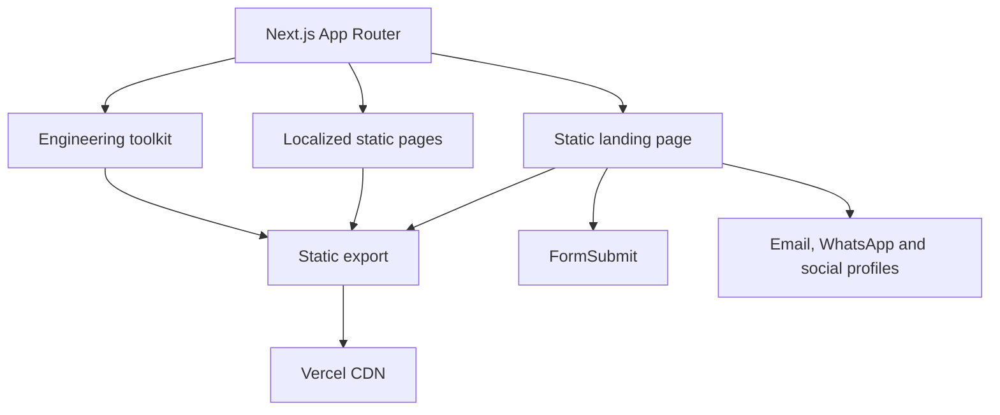

# Ephraim Lifanjo Portfolio

<p align="center">
  
</p>

A fast, static, multilingual software engineering portfolio built with Next.js and React. The site is designed for strong crawlability, mobile performance, international SEO and zero application-backend maintenance.

<p align="center">
  
  &nbsp;&nbsp;&nbsp;
  
</p>

## Included

- Static Next.js export with CDN delivery.
- Responsive desktop, tablet and small-screen layouts.
- Light and dark themes with system detection.
- A custom-built language picker with browser language detection.
- English, French, German, Spanish, Portuguese, Italian, Chinese, Japanese, Korean, Arabic and Russian routes.
- Canonical URLs, hreflang alternates, Open Graph, X cards, Schema.org, sitemap and robots rules.
- Google, Bing, DuckDuckGo, Apple, Yandex, Baidu and other compatible crawler support.
- `llms.txt` and IndexNow discovery files.
- A transparent local SVG brand mark derived from the supplied logo artwork.
- Local React SVG icons with explicit brand colors, including LinkedIn, GitHub, Canva, technology stacks and social profiles.
- Contact through FormSubmit, direct email and WhatsApp.
- Photo hover interaction with touch and reduced-motion fallbacks.
- GitHub Actions production build verification on every push to `main`.

## Architecture



## Project structure

```text
app/
  [lang]/page.js            Localized landing pages
  toolkit/page.js           Engineering toolkit
  icon.svg                  Transparent visible brand mark and favicon
  layout.js                 Global metadata and structured data
  sitemap.js                Search sitemap
  robots.js                 Crawler rules
components/
  Brand.jsx                 Header brand
  PortfolioPage.jsx         Shared landing page UI
  LanguageSwitcher.jsx      Custom language picker and detection
  LanguageSwitcher.module.css
  SocialLinks.jsx           Colored social icons
  ThemeToggle.jsx           Theme control
data/
  site.js                   Profile, social links and collaboration data
  i18n.js                   Locale configuration and translated copy
public/
  ephraim.webp              Optimized portrait
  card.png                  Social sharing cover
  llms.txt                  Machine-readable portfolio summary
scripts/
  export-static.mjs         Copies the Next static export into public
```

## Reproduce the implementation

### 1. Install

```bash
git clone https://github.com/ephraimlifanjo/ephraim-portfolio.git
cd ephraim-portfolio
npm install
npm run dev
```

### 2. Replace identity assets

Update these files while preserving their purpose:

```text
app/icon.svg
public/ephraim.webp
public/card.png
```

Use a square SVG viewBox for the mark, compressed WebP for the portrait and a 1200 by 630 social card.

### 3. Edit public profile data

Update `data/site.js` for the name, professional title, contact links and social profiles. External profile URLs from this file are also included in Schema.org `sameAs` metadata.

### 4. Configure languages

`data/i18n.js` contains the supported locales and translated copy. English is the fallback. `LanguageSwitcher.jsx` detects a supported browser language, remembers the visitor preference in `localStorage` and navigates to a crawlable static locale route.

### 5. Configure contact

The collaboration form posts directly to FormSubmit:

```html
<form action="https://formsubmit.co/you@example.com" method="POST">
```

FormSubmit may require a one-time inbox confirmation for the receiving address. Email and WhatsApp remain direct alternatives.

### 6. SEO checklist

Review these files before using the template for another person or domain:

- `app/layout.js`: title, description, keywords, Open Graph and Schema.org.
- `app/sitemap.js`: canonical hostname and localized routes.
- `app/robots.js`: crawler access and sitemap URL.
- `public/llms.txt`: concise identity and technology summary.
- `public/7ca8393296cfd5bb7543eabc068cc05e.txt`: IndexNow key.

Avoid keyword stuffing. Search visibility is improved through useful text, semantic HTML, stable canonical URLs, fast delivery, crawlable locale routes, trustworthy external profiles and genuine backlinks.

### 7. Production build

```bash
npm run build
```

The project exports static HTML and assets. `scripts/export-static.mjs` places the generated result in `public/` for the current Vercel configuration.

### 8. Vercel

Current production configuration:

```text
Build command: npm run build
Output directory: public
Node.js: 22 or newer
Environment variables: none required
```

Production URL:

```text
https://ephraimlifanjo.vercel.app
```

## Performance decisions

- No external web-font request.
- Static HTML and CDN caching.
- Optimized WebP portrait.
- Local SVG favicon and local icon components.
- No external icon CDN.
- `content-visibility` for lower-page sections.
- Client JavaScript limited to theme and language interactions.
- No database SDK, analytics SDK or runtime API client on the landing page.
- Reduced-motion and touch-device fallbacks.

## Validation

After every change:

```bash
npm run build
```

Then verify `/`, `/toolkit/`, several locale routes, `/robots.txt`, `/sitemap.xml`, `/llms.txt` and `/icon.svg`. GitHub Actions performs the production build automatically on pushes to `main`.

## License and reuse

The code structure may be adapted for another portfolio. Replace the portrait, mark, public profile information, contact details, social accounts and written biography before publishing it.

© 2026 Ephraim Lifanjo Sewa.
